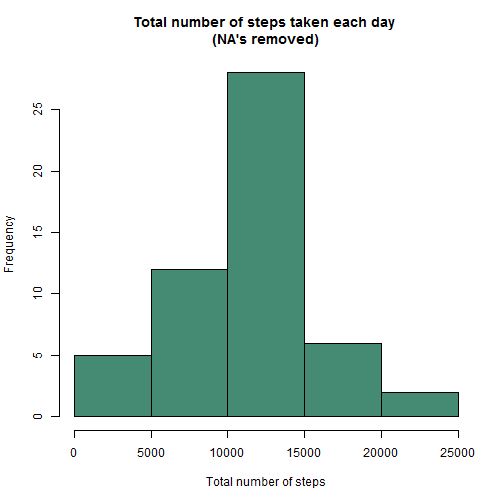
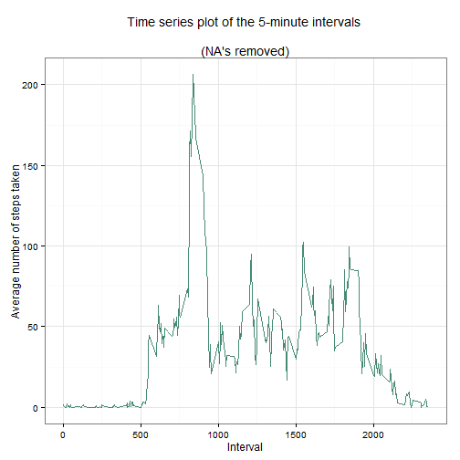
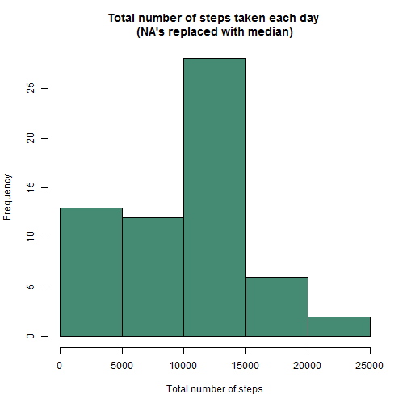
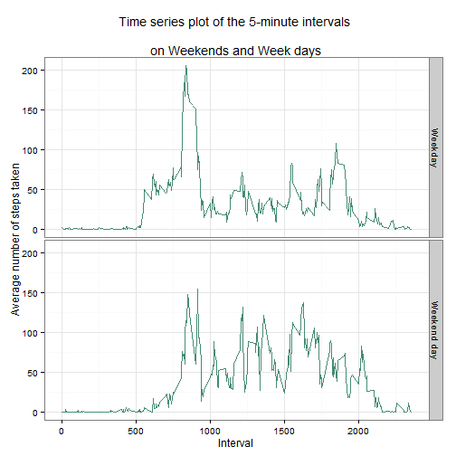

Peer Assessment 1
=================


##Loading and preprocesing the data

####1. Load the data


```r
data <- read.csv("activity.csv", header=TRUE)
```


####2. Process/transform the data into a format suitable for analysis

Examine class of variables

```r
lapply(data, class)
```

```
## $steps
## [1] "integer"
## 
## $date
## [1] "factor"
## 
## $interval
## [1] "integer"
```

Formatting date variable

```r
data$date <- as.Date(data$date, "%Y-%m-%d")
```


##What is mean total number of steps taken per day?

####1. Calculate the total number of steps taken per day


```r
steps.total <- aggregate(steps ~ date, data = data, sum, na.rm = TRUE)
```


####2. Make a histogram of the total number of steps taken each day


```r
hist(steps.total$steps, col = "aquamarine4", bg = "transparent", 
     main = "Total number of steps taken each day \n(NA's removed)",
     xlab = "Total number of steps",
     ylab = "Frequency")
```

 


####3. Calculate and report the mean and median of the total number of steps 
####taken per day

Mean of the total number of steps taken per day

```r
mean(steps.total$steps)
```

```
## [1] 10766.19
```

Median of the total number of steps taken per day

```r
median(steps.total$steps)
```

```
## [1] 10765
```


##What is the average daily activity pattern?

####1. Make a time series plot of the 5-minute interval (x-axis) 
####and the average number of steps taken, averaged across all days (y-axis)

Calculation of average number of steps taken each day

```r
steps.average <- aggregate(steps ~ interval, data = data, mean, na.rm = TRUE)
```

Time series plot

```r
library(ggplot2)
ggplot(steps.average) +
        aes(x = interval, y = steps) + 
        geom_line(colour = "aquamarine4") +
        theme_bw() + 
        labs(x = "Interval") + 
        labs(y = "Average number of steps taken") +
        labs(title = "Time series plot of the 5-minute intervals 
             \n(NA's removed)")
```

 


####2. Which 5-minute interval, on average across all the days in the dataset, 
####contains the maximum number of steps?


```r
steps.average$interval[which.max(steps.average$steps)]
```

```
## [1] 835
```


##Imputing missing values

####1. Calculate and report the total number of missing values in the dataset 
####(i.e. the total number of rows with NAs)


```r
nrow(data[!complete.cases(data), ])
```

```
## [1] 2304
```


####2. Devise a strategy for filling in all of the missing values in the 
####dataset. 

Missing values were replaced with median for the non-NA values associated with 
each interval. Median was used since it is more appropriate measure of 
central tendency in cases of skewed distributions and distributions with 
outliers. If distribution is simetrical and without outliers median is the same
as the mean.

First, a variable with median values of each interval was created

```r
data$median.steps.per.interval <- ave(data$steps, data$interval, 
                                    FUN = function(x) 
                                            median(x, na.rm = TRUE))
```

Then another new variable was created, with values the same as those in 'steps'
variable, but missing values were replaced with median values associated with
intervals. New variable was made in order to keep original variables as they 
were in an original data set.

```r
data$steps.filled <- ifelse(is.na(data$steps), 
                            data$median.steps.per.interval, data$steps)
```


####3. Create a new dataset that is equal to the original dataset but with 
####the missing data filled in

New data set was made, consisting of the same variables as the original data set

```r
library(dplyr)
```

```
## 
## Attaching package: 'dplyr'
## 
## The following object is masked from 'package:stats':
## 
##     filter
## 
## The following objects are masked from 'package:base':
## 
##     intersect, setdiff, setequal, union
```

```r
data.na.replaced <- select(data, c(steps.filled, date, interval))
```

Since in new data set variable 'steps' was named 'steps.filled', it was renamed
in order to make the new data set equal to the original

```r
library(dplyr)
data.na.replaced <- rename(data.na.replaced, steps = steps.filled)
```


####4. Make a histogram of the total number of steps taken each day and Calculate 
####and report the mean and median total number of steps taken per day. 
####Do these values differ from the estimates from the first part of the 
####assignment? What is the impact of imputing missing data on the estimates 
####of the total daily number of steps?

Calculation of the total number of steps taken per day

```r
steps.total.na.replaced <- aggregate(steps ~ date, 
                                     data = data.na.replaced, sum)
```

Histogram of the total number of steps taken each day

```r
hist(steps.total.na.replaced$steps, col = "aquamarine4", bg = "transparent", 
     main = "Total number of steps taken each day \n(NA's replaced with median)",
     xlab = "Total number of steps",
     ylab = "Frequency")
```

 

Mean of the total number of steps taken per day

```r
mean(steps.total.na.replaced$steps)
```

```
## [1] 9503.869
```

Median of the total number of steps taken per day

```r
median(steps.total.na.replaced$steps)
```

```
## [1] 10395
```

These values differ from the estimates from the first part of the assignment, 
but to a small degree. Impact of imputing missing data on the estimates consists
of having more values the same as the imput value, so it can affect measures of 
central tendency. Since imput values were based on median, median value is now 
a more commom observation and measures of central tendency were moved toward 
those values.


##Are there differences in activity patterns between weekdays and weekends?

####1. Create a new factor variable in the dataset with two levels - "weekday" 
####and "weekend" indicating whether a given date is a weekday or weekend day.

First, a variable with (all) weekdays was made

```r
data.na.replaced$weekday <- weekdays(data.na.replaced$date)
```

Class of new variable was checked

```r
class(data.na.replaced$weekday)
```

```
## [1] "character"
```

...since it was 'character', variable was formatted as factor

```r
data.na.replaced$weekday <- as.factor(data.na.replaced$weekday)
class(data.na.replaced$weekday)
```

```
## [1] "factor"
```

Then, a factor variable was created, indicating whether a given day 
is a weekday or weekend day

```r
library(car)
data.na.replaced$weekday.type <- recode(data.na.replaced$weekday,
                                        "c('Saturday', 'Sunday')='Weekend day';
                                        else='Weekday'",
                                        as.factor.result=TRUE)
```


####2. Make a panel plot containing a time series plot of the 5-minute interval 
####(x-axis) and the average number of steps taken, averaged across all 
####weekday days or weekend days (y-axis). 

Calculation of the average number of steps

```r
steps.average.na.replaced <- aggregate(steps ~ interval + weekday.type, 
                                       data = data.na.replaced, mean)
```

panel plot containing a time series plot

```r
library(ggplot2)

ggplot(steps.average.na.replaced) +
        aes(x = interval, y = steps) + 
        geom_line(colour = "aquamarine4") +
        facet_grid(weekday.type ~.) + 
        theme_bw() + 
        labs(x = "Interval") + 
        labs(y = "Average number of steps taken") +
        labs(title = "Time series plot of the 5-minute intervals 
             \non Weekends and Week days")
```

 


